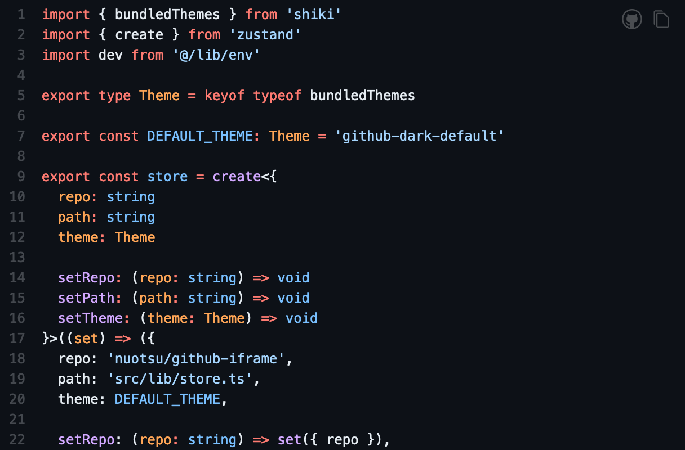

# GitHub iframe

Display live GitHub code in an iframe.

> [Demo](https://github-iframe.vercel.app)

```html
<iframe src="https://github-iframe.vercel.app/{owner}/{repo}/{path}"></iframe>

<!-- e.g. -->
<iframe
	src="https://github-iframe.vercel.app/nuotsu/github-iframe/src/app/globals.css"
	width="100%"
	height="400px"
></iframe>
```


