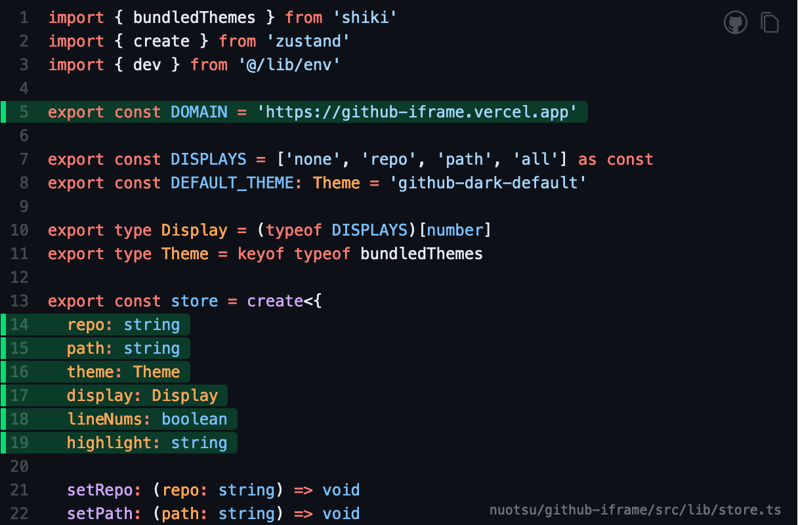

# GitHub iframe

Display live GitHub code in an iframe.

> [Demo](https://github-iframe.vercel.app) | [Blog post](https://sanitypress.dev/blog/introducing-github-iframe)

```html
<iframe src="https://github-iframe.vercel.app/{owner}/{repo}/{path}"></iframe>

<!-- e.g. -->
<iframe
	src="https://github-iframe.vercel.app/nuotsu/github-iframe/src/lib/store.ts"
	width="100%"
	height="400px"
	title="nuotsu/github-iframe/src/lib/store.ts"
></iframe>
```

## Preview



## Name options

Open to suggestions:

- iframehub (https://iframehub.dev)
- framehub (https://framehub.dev)
